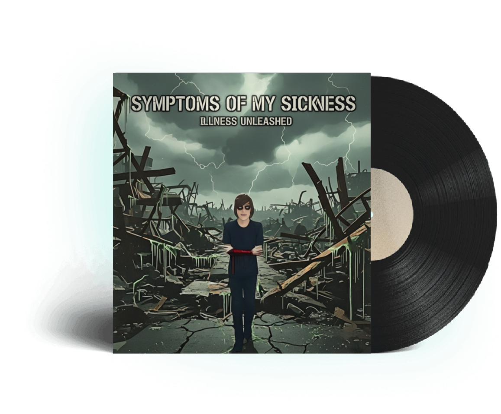

# Symptoms Of My Sickness - Album Player

**A professional, immersive web-based music player for the album "Symptoms Of My Sickness" by Risk.**



## 📑 Table of Contents

- [🎸 Features](#-features)
- [🎵 Tracklist](#-tracklist)
- [🚀 Quick Start](#-quick-start)
- [View Online](#view-online)
- [📁 Project Structure](#-project-structure)
- [🎨 Technologies Used](#-technologies-used)
- [⚠️ Content Warning](#️-content-warning)
- [🎤 About the Artist](#-about-the-artist)
- [📄 License](#-license)

---

## 🎸 Features

- **Stunning Visual Experience**: Animated particle visualizer that reacts to the music
- **Full Album Playback**: All 12 tracks from "Symptoms Of My Sickness"
- **Modern UI**: Glassmorphism design with dark blue neon aesthetic
- **Responsive Design**: Optimized for desktop, tablet, and mobile devices
- **Shuffle, Autoplay & Loop**: Full playback control - autoplay enabled by default
- **Animated Background**: Dynamic background that plays during music playback
- **Content Warning**: Built-in accessibility features with text-to-speech warnings
- **Touch-Optimized**: Full mobile and touch device support

## 🎵 Tracklist

1. **Consumption of Silence**
2. **The Architect's Lie**
3. **Viral Parasite**
4. **Ghost Protocol**
5. **Neon Anesthesia**
6. **Risky Business (Apology Tribute to Snowball)**
7. **Surveillance State**
8. **Memory Corruption**
9. **Neural Hijack**
10. **Synthetic Love**
11. **Digital Afterlife**
12. **System Reboot**

## 🚀 Quick Start

### View Online
Simply open `index.html` in any modern web browser.

```

## 📁 Project Structure

```
Album-Player-Website/
│
├── index.html              # Main HTML file
├── README.md              # This file
│
├── assets/                # Images and media
│   ├── album-cover.png   # Album artwork
│   └── bg.webp           # Animated background
│
└── music/                 # Audio files
    ├── Consumption of Silence.mp3
    ├── The Architect's Lie.mp3
    ├── Viral Parasite.mp3
    ├── Ghost Protocol.mp3
    ├── Neon Anesthesia.mp3
    ├── Risky Business (Apology Tribute to Snowball).mp3
    ├── Surveillance State.mp3
    ├── Memory Corruption.mp3
    ├── Neural Hijack.mp3
    ├── Synthetic Love.mp3
    ├── Digital Afterlife.mp3
    └── System Reboot.mp3
```

## 🎨 Technologies Used

- **HTML5**: Structure and audio player
- **CSS3**: Styling, animations, and responsive design
- **JavaScript**: Interactive features and visualizer
- **Canvas API**: Particle visualizer effects
- **Web Speech API**: Accessibility text-to-speech

## ⚠️ Content Warning

This album contains:
- Flashing lights and strobing effects
- Explicit language and mature themes
- Topics of violence and intense emotional content
- Topics of self-harm and mental health struggles

**Parental guidance and viewer discretion are advised.**

If you or someone you know is struggling, please call the **Suicide Prevention Hotline**: **988**

## 🎤 About the Artist

**Risk** is a multidisciplinary creator blending music, software, and immersive storytelling. Fusing hard rock and screamo with experimental sound design, Risk codes custom tools to manipulate audio, visuals, and interactive experiences. Obsessed with pushing boundaries, Risk turns personal chaos into structured digital art, exploring isolation, intensity, and raw emotion through both sound and code.


## 📄 License

© 2025 Risk. All rights reserved.

This is a promotional website for the album "Symptoms Of My Sickness". 

---

**Illness Unleashed** 🎸⚡

*Built with passion, code, and chaos by Risk*

